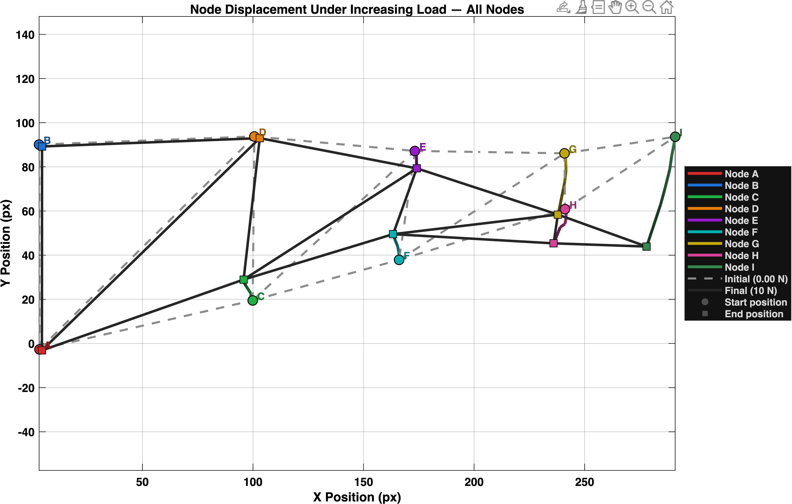
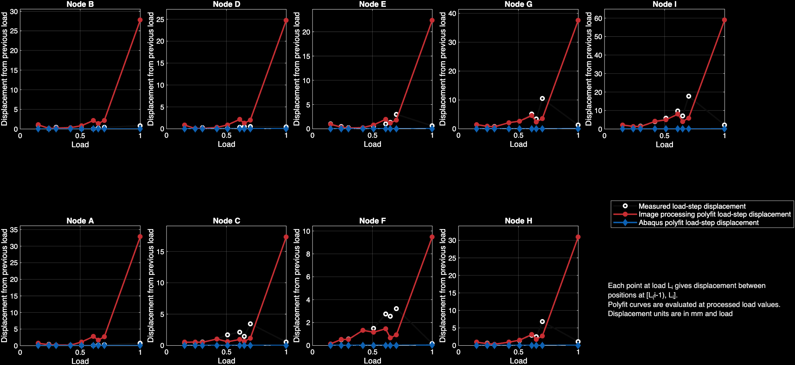

#  DISPLACEMENT COMPARISON BETWEEN PRACTICAL EXPERIMENT AND ABAQUS SIMULATION AND JUSTIFICATION

## Experimental vs. Abaqus Comparison

### The Discrepancy
While Abaqus predicted ideal, linear, planar displacements, the physical truss exhibited irregular, non-linear, and larger-than-expected shifts (particularly at nodes C, E, F, G, H, and I). The simulation assumed stationary boundary nodes and smooth vertical drops, but the actual truss experienced out-of-plane drift and erratic trajectories after the 0.5 kg load threshold.
### Root Causes of Divergence(Justification)
The simulation failed to account for real-world variables that compromised its 2D, idealized assumptions:
•	3D Geometry & Eccentricity: Multi-member joints at varying depths introduced torsion and bending moments instead of pure axial loading.
•	Joint & Fabrication Imperfections: Uneven attachments and deviations in member lengths/hole placements caused stress concentrations and localized rotations.
•	Material Variability: Non-homogeneous stiffness and reduced cross-sectional integrity at drill sites weakened the physical structure relative to the uniform FEA model.
### Conclusion
Abaqus is a reliable baseline only for low-load elastic behaviour. Beyond 0.5 kg, structural performance is dominated by manufacturing tolerances and 3D effects, proving that idealized FEA models cannot capture the complexity of physical assembly quality.

